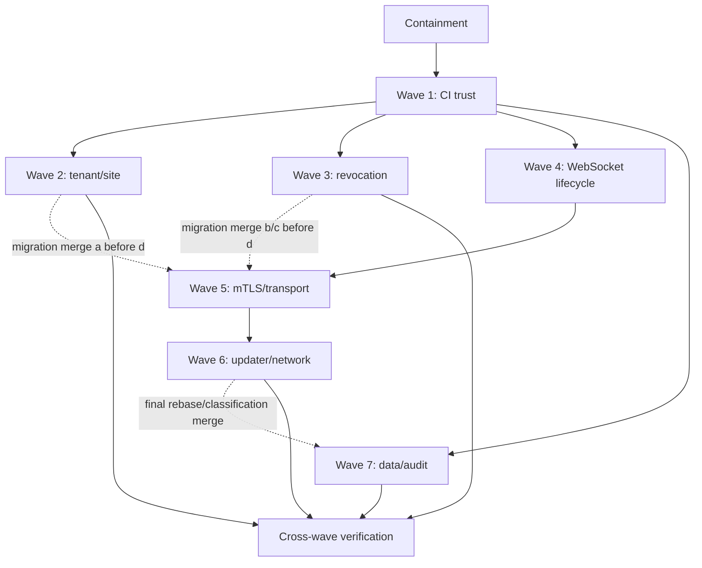

# Full Security Review Remediation Program Implementation Plan

> **For agentic workers:** REQUIRED SUB-SKILL: Use superpowers:subagent-driven-development (recommended) or superpowers:executing-plans to implement this plan task-by-task. Steps use checkbox (`- [ ]`) syntax for tracking.

**Goal:** Coordinate containment and seven independently deployable remediation waves that close all 25 findings without combining unrelated trust boundaries or breaking hosted and self-hosted installations.

**Architecture:** The program repairs CI trust first, then executes tenant, revocation, WebSocket, and data-protection waves on isolated branches. Agent mTLS and updater/network waves follow through sequential canary releases. The approved design is the source of global security invariants; each linked wave plan is a standalone execution contract.

**Tech Stack:** GitHub Actions, Hono/TypeScript, PostgreSQL/Drizzle forced RLS, Redis, BullMQ, Astro/React, Go agent, Cloudflare/Caddy, Vitest, Playwright, Go `testing`.

## Global Constraints

- Approved design: `docs/superpowers/specs/security-auth/2026-07-23-full-security-review-remediation-design.md`.
- Internal source report: `internal/security-reviews/2026-07-23-full-security-review.md`; do not copy exploit reproduction steps into public PRs or release notes.
- Start every execution branch from a freshly fetched `origin/main`; never implement from this documentation branch.
- Use repository branch names from the registry below; never use an agent/tool/vendor prefix.
- One wave owns one security boundary, PR, deployment gate, and rollback boundary.
- Reserve migration order across concurrent branches as `2026-08-06-a` through `-f`: Wave 2
  owns `a`, Wave 3 owns `b/c`, Wave 5 owns `d`, and Wave 6 owns `e/f`. Development may overlap,
  but migration-bearing PRs merge in that order. If `origin/main` advances past the reservation,
  stop and revise every affected plan centrally before writing SQL.
- Follow red-green TDD and prove each security regression fails before implementing the fix.
- Every tenant-scoped migration is date-prefixed, idempotent, forward-only, forced-RLS covered, and verified as `breeze_app`.
- Denied requests perform no mutation, queue submission, system-context transition, external call, snapshot, email, or success audit.
- Self-hosted mTLS remains opt-in and progresses through `off`, `audit`, and `enforce`.
- Preserve explicitly configured private control-plane and approved LAN software sources.
- Maintain the documented old/new API and agent compatibility window; drain old instances before declaring enforcement complete.
- Agent rollout uses internal/staging, 1%, 10%, 50%, and 100% rings with recorded stop criteria.
- Rollback disables enforcement while retaining forward-compatible schema and durable security state.
- Obtain one independent security/code review per wave and resolve every Critical or Important result.
- Do not push this planning branch or publish the internal report before coordinated disclosure approval.

---

## Artifact Registry

| Stage | Finding IDs | Execution artifact | Implementation branch | PR title |
|---|---|---|---|---|
| Containment | Operational exposure reduction | `docs/superpowers/plans/security-auth/2026-07-23-security-remediation-containment.md` | N/A — operator runbook | N/A — private change record |
| Wave 1 | `CI-ACTIONS-001`, `CI-PR-SECRET-001`, `CI-DEVSIGN-001`, `CI-E2E-LOCK-001` | `docs/superpowers/plans/security-auth/2026-07-23-security-remediation-wave-01-ci-trust.md` | `fix/security-review-ci-trust` | `fix(ci): isolate secrets and signing authority` |
| Wave 2 | `TENANT-SITE-REPORT-001`, `TENANT-SITE-AGG-001` | `docs/superpowers/plans/security-auth/2026-07-23-security-remediation-wave-02-tenant-site-scope.md` | `fix/security-review-tenant-site-scope` | `fix(reports): enforce persisted site scope` |
| Wave 3 | `AUTH-OAUTH-001`, `P1-WS-003`, `PUBLIC-REVOKE-001` | `docs/superpowers/plans/security-auth/2026-07-23-security-remediation-wave-03-revocation-live-authorization.md` | `fix/security-review-live-revocation` | `fix(auth): enforce durable live revocation` |
| Wave 4 | `P1-WS-001`, `P1-WS-002` | `docs/superpowers/plans/security-auth/2026-07-23-security-remediation-wave-04-websocket-lifecycle.md` | `fix/security-review-websocket-lifecycle` | `fix(remote): bind websocket ownership and teardown` |
| Wave 5 | `P1-MTLS-001`, `P1-MTLS-002`, `P1-MTLS-004`, `TRANSPORT-001` | `docs/superpowers/plans/security-auth/2026-07-23-security-remediation-wave-05-mtls-transport.md` | `fix/security-review-mtls-transport` | `fix(agent-auth): bind certificates and device identity` |
| Wave 6 | `P1-UPD-003`, `P1-UPD-001`, `P1-UPD-002`, `SSRF-AGENT-001`, `P1-AGENT-LOG-001` | `docs/superpowers/plans/security-auth/2026-07-23-security-remediation-wave-06-agent-updater-network.md` | `fix/security-review-agent-network` | `fix(agent): harden updater and outbound network trust` |
| Wave 7 | `SEC-LOG-001`, `DP-EXPORT-001`, `AUDIT-001`, `AUDIT-READ-001`, `DP-PUBLIC-QUOTE-001` | `docs/superpowers/plans/security-auth/2026-07-23-security-remediation-wave-07-data-audit.md` | `fix/security-review-data-audit` | `fix(security): minimize exports and complete audit coverage` |

## Containment Ledger Semantics

Use `No`, `Partial`, or `Yes` in the `Contained` column. `Yes` means every known production path
for that finding has a recorded before-state, the exposure is blocked, and the post-change
acceptance check passed. Use `Partial` when only a subset of paths, tenants, hosts, agents, or
credentials was covered. Observation, inventory, WAF Log mode, or a candidate revocation list is
never `Yes` by itself.

| Finding | Maximum Stage 0 state | Acceptance required before `Contained=Yes` |
|---|---|---|
| `CI-PR-SECRET-001` | Yes | The pull-request path is disabled or proven unable to receive repository/environment secrets or protected OIDC authority; rotate any credential shown to have reached untrusted code. |
| `CI-DEVSIGN-001` | Yes | Developer signing is unavailable to unapproved jobs and the protected environment has required reviewers, branch/tag restrictions, and no bypass path. |
| `P1-MTLS-001` | Partial | Log mode only records evidence. Leave `Partial` until the Wave 5 binding gate blocks every covered mismatched or absent identity. |
| `P1-MTLS-002` | Partial | Revoking approved stale certificates reduces exposure, but valid-certificate-to-bearer device binding is not closed until Wave 5 deploys and enforces the binding gate. |
| `P1-MTLS-004` | Partial | Revoking approved stale certificates reduces exposure, but lossless future revocation is not closed until Wave 5 deploys durable certificate history and retry. |
| `TRANSPORT-001` | Yes | Every hosted origin listener is reachable only through the approved edge path and heartbeat, enrollment, REST, and command-WebSocket canaries pass. |
| `TENANT-SITE-REPORT-001` | Yes | All affected schedules are paused and every historical restricted report path is denied pending Wave 2 provenance. A tenant/sample-only restriction is `Partial`. |
| `DP-EXPORT-001` | Partial | Nonessential export authority is removed from every reviewed account and the endpoint is unavailable to unapproved roles. It remains `Partial` until Wave 7 field minimization is deployed. |
| `SSRF-AGENT-001` | Partial | Managed-software execution is unavailable to unapproved roles and sources. It remains `Partial` until Wave 6 enforces redirect, resolution, and dial policy. |
| `SEC-LOG-001` | Yes | Access to every affected retained log is restricted or the retained copy is purged, and all live capabilities proven exposed there are rotated. |
| `DP-PUBLIC-QUOTE-001` | Yes | Every public quote capability proven exposed is rotated only after its exposure path is closed. |
| `P1-AGENT-LOG-001` | Yes | Every deployed Unix endpoint in scope passes the no-symlink and restrictive-mode verification; incomplete fleet coverage is `Partial`. |

All findings not listed above remain `Contained=No` until their implementation wave blocks the
exposure. Certificate revocation is irreversible: record its re-enrollment/reissuance procedure as
recovery, not rollback.

## Dependency and Concurrency Contract



- Containment starts immediately but does not enable blocking mTLS or invalidate customer links without operator approval.
- Wave 1 merges before any runtime remediation relies on repository CI, build artifacts, or signing.
- With three worker slots, implement Waves 2, 3, and 4 in parallel after Wave 1. Start Wave 7 as soon as one slot clears.
- Wave 5 development begins after Wave 4 is merged so remote-session ownership and cleanup are
  already reliable before agent identity enforcement. Its `-d-` migration PR does not merge until
  the Wave 2 `-a-` and Wave 3 `-b-`/`-c-` migrations are merged.
- Wave 6 may be developed while Wave 5 observes audit telemetry, but its fleet promotion begins only after the Wave 5 compatibility decision.
- Wave 7 development begins after Wave 1 and may run in parallel. Hold its final rebase, complete
  export-classification verification, and merge until Waves 5 and 6 are merged so their new tables
  and columns cannot strand tenant export in a fail-closed outage.
- Do not share one implementation worktree between waves. Do not assign two workers files from the same wave.

### Task 1: Establish the confidential execution ledger

**Files:**
- Create: `internal/security-remediation/2026-07-23-execution-ledger.md`
- Read: `docs/superpowers/specs/security-auth/2026-07-23-full-security-review-remediation-design.md`
- Read: `internal/security-reviews/2026-07-23-full-security-review.md`

**Interfaces:**
- Consumes: the 25 finding IDs and eight execution artifacts in the registry.
- Produces: a confidential ledger separating `contained`, `code_merged`, `deployed`, `observed`, and `enforced`.

- [ ] **Step 1: Resolve and enter the canonical primary checkout**

Run from any checkout:

```bash
git_common="$(git rev-parse --path-format=absolute --git-common-dir)"
repo_root="$(cd "$git_common/.." && pwd -P)"
test "$(git -C "$repo_root" rev-parse --show-toplevel)" = "$repo_root"
cd "$repo_root"
test -f internal/security-reviews/2026-07-23-full-security-review.md
```

Expected: exit 0 in the primary checkout. The ignored internal report and confidential ledger do
not exist automatically in linked worktrees.

- [ ] **Step 2: Create the ledger with one row per finding**

Use this exact header:

```markdown
| Finding | Wave | Contained (No/Partial/Yes) | Code merged | Deployed | Observed | Enforced | Evidence | Owner |
|---|---:|---|---|---|---|---|---|---|
```

Populate all 25 IDs from the Artifact Registry. Use `No` for every state and leave Evidence and Owner empty. Do not include exploit reproduction steps.

- [ ] **Step 3: Validate complete finding coverage**

Run:

```bash
report=internal/security-remediation/2026-07-23-execution-ledger.md
test "$(rg -o '(AUTH-OAUTH-001|TENANT-SITE-REPORT-001|P1-UPD-003|P1-MTLS-001|P1-MTLS-002|P1-WS-002|P1-WS-003|P1-WS-001|SEC-LOG-001|DP-EXPORT-001|CI-ACTIONS-001|CI-PR-SECRET-001|CI-DEVSIGN-001|CI-E2E-LOCK-001|TENANT-SITE-AGG-001|AUDIT-001|P1-UPD-001|P1-UPD-002|P1-MTLS-004|P1-AGENT-LOG-001|AUDIT-READ-001|PUBLIC-REVOKE-001|SSRF-AGENT-001|TRANSPORT-001|DP-PUBLIC-QUOTE-001)' "$report" | sort -u | wc -l | tr -d ' ')" -eq 25
```

Expected: exit 0.

- [ ] **Step 4: Keep the ledger confidential**

Run:

```bash
git check-ignore -v internal/security-remediation/2026-07-23-execution-ledger.md
```

Expected: output names the `/internal/*` ignore rule.

The ledger is intentionally uncommitted. Update it after every containment, merge, deploy, observation, enforcement, or rollback event.

### Task 2: Execute reversible containment

**Files:**
- Execute: `docs/superpowers/plans/security-auth/2026-07-23-security-remediation-containment.md`
- Update: `internal/security-remediation/2026-07-23-execution-ledger.md`

**Interfaces:**
- Consumes: operator access to GitHub, telemetry, hosted edge policy, and deployment configuration.
- Produces: recorded evidence and reversible exposure reductions without claiming code remediation.

- [ ] **Step 1: Run the containment plan in its documented order**

Use the exact evidence-preservation, exposure-closure, credential-rotation, edge-audit, report/export restriction, and rollback steps in the containment artifact.

- [ ] **Step 2: Record containment evidence**

For each affected finding, apply the exact acceptance rule in **Containment Ledger Semantics**.
Change only the `Contained` state to `Partial` or `Yes` and add the evidence location or command
result. Leave `Code merged`, `Deployed`, `Observed`, and `Enforced` unchanged. If the acceptance
rule is not fully proven, leave it `No` or `Partial`.

- [ ] **Step 3: Review containment before Wave 1**

Confirm:

```text
- No repository secret reaches PR-controlled code.
- Signing secrets are approval-gated or temporarily unavailable.
- No blocking mTLS rule was enabled without compatibility evidence.
- No customer link or credential was rotated before its exposure path was closed.
- Every reversible operational change has a tested rollback.
- Irreversible certificate revocation has second-operator approval and a tested recovery/reissuance procedure.
```

Expected: all confirmations recorded in the ledger.

### Task 3: Merge Wave 1 and establish trusted delivery

**Files:**
- Execute: `docs/superpowers/plans/security-auth/2026-07-23-security-remediation-wave-01-ci-trust.md`
- Update: `internal/security-remediation/2026-07-23-execution-ledger.md`

**Interfaces:**
- Consumes: completed containment evidence.
- Produces: secret-free PR CI, deterministic `e2e-tests` installation, protected signing, and immutable Action references.

- [ ] **Step 1: Create the Wave 1 worktree**

Run from the canonical repository:

```bash
git_common="$(git rev-parse --path-format=absolute --git-common-dir)"
repo_root="$(cd "$git_common/.." && pwd -P)"
git -C "$repo_root" fetch --prune origin
remote_sha="$(git -C "$repo_root" rev-parse origin/main)"
advertised_sha="$(git -C "$repo_root" ls-remote --heads origin refs/heads/main | awk '{print $1}')"
test -n "$advertised_sha"
test "$remote_sha" = "$advertised_sha"
worktree="$repo_root/.worktrees/security-review-ci-trust"
test ! -e "$worktree"
git -C "$repo_root" worktree add "$worktree" -b fix/security-review-ci-trust "$remote_sha"
test "$(git -C "$worktree" rev-parse HEAD)" = "$remote_sha"
test -z "$(git -C "$worktree" status --short)"
```

Expected: clean worktree on `fix/security-review-ci-trust` at the SHA currently advertised by
`origin/main`.

- [ ] **Step 2: Execute the Wave 1 plan task-by-task**

Use subagent-driven development with a fresh worker per task and one independent requirements/code review before merge.

- [ ] **Step 3: Verify the trusted-delivery gate**

Run the exact Wave 1 verification commands and confirm GitHub environment reviewers through the GitHub configuration/API. Repository YAML alone is insufficient.

- [ ] **Step 4: Merge and update the ledger**

After CI and review pass, merge the Wave 1 PR. Mark its four findings `Code merged=Yes`, then separately update `Deployed`, `Observed`, and `Enforced` from actual GitHub configuration evidence.

### Task 4: Fan out API remediation waves

**Files:**
- Execute: `docs/superpowers/plans/security-auth/2026-07-23-security-remediation-wave-02-tenant-site-scope.md`
- Execute: `docs/superpowers/plans/security-auth/2026-07-23-security-remediation-wave-03-revocation-live-authorization.md`
- Execute: `docs/superpowers/plans/security-auth/2026-07-23-security-remediation-wave-04-websocket-lifecycle.md`
- Update: `internal/security-remediation/2026-07-23-execution-ledger.md`

**Interfaces:**
- Consumes: trusted Wave 1 delivery and the current `origin/main`.
- Produces: three independently reviewed PRs with no shared worktree or commit history.

- [ ] **Step 1: Create three worktrees from the same current main**

Run:

```bash
git_common="$(git rev-parse --path-format=absolute --git-common-dir)"
repo_root="$(cd "$git_common/.." && pwd -P)"
git -C "$repo_root" fetch --prune origin
remote_sha="$(git -C "$repo_root" rev-parse origin/main)"
advertised_sha="$(git -C "$repo_root" ls-remote --heads origin refs/heads/main | awk '{print $1}')"
test -n "$advertised_sha"
test "$remote_sha" = "$advertised_sha"
tenant_tree="$repo_root/.worktrees/security-review-tenant-site"
revocation_tree="$repo_root/.worktrees/security-review-live-revocation"
websocket_tree="$repo_root/.worktrees/security-review-websocket"
test ! -e "$tenant_tree"
test ! -e "$revocation_tree"
test ! -e "$websocket_tree"
git -C "$repo_root" worktree add "$tenant_tree" -b fix/security-review-tenant-site-scope "$remote_sha"
git -C "$repo_root" worktree add "$revocation_tree" -b fix/security-review-live-revocation "$remote_sha"
git -C "$repo_root" worktree add "$websocket_tree" -b fix/security-review-websocket-lifecycle "$remote_sha"
test "$(git -C "$tenant_tree" rev-parse HEAD)" = "$remote_sha"
test "$(git -C "$revocation_tree" rev-parse HEAD)" = "$remote_sha"
test "$(git -C "$websocket_tree" rev-parse HEAD)" = "$remote_sha"
test -z "$(git -C "$tenant_tree" status --short)"
test -z "$(git -C "$revocation_tree" status --short)"
test -z "$(git -C "$websocket_tree" status --short)"
```

Expected: three clean, independent worktrees.

- [ ] **Step 2: Assign one coordinator-owned worker per wave**

Each worker reads only its approved wave plan plus required project instructions. The coordinator owns cross-wave decisions, rebases, final review, and ledger updates.

- [ ] **Step 3: Execute each wave through its merge gate**

Each wave must demonstrate red-green regression tests, focused and package suites, mixed-version or instance-drain evidence, and one independent review before merge.

- [ ] **Step 4: Merge without unsafe rollback**

Before merging each PR, refresh from `origin/main`, rerun affected tests, and confirm that rollback leaves:

```text
- site-restricted report reads fail closed;
- live OAuth/event authorization checks enabled;
- exact socket ownership enabled;
- desktop teardown delete-last behavior enabled.
```

- [ ] **Step 5: Update the ledger from actual state**

Do not mark a finding `Enforced=Yes` merely because its code merged. Record migration, deployment, old-instance drain, observation, and enforcement separately.

### Task 5: Develop Wave 7 when an API worker slot clears

**Files:**
- Execute: `docs/superpowers/plans/security-auth/2026-07-23-security-remediation-wave-07-data-audit.md`
- Update: `internal/security-remediation/2026-07-23-execution-ledger.md`

**Interfaces:**
- Consumes: trusted Wave 1 delivery; it does not depend on Waves 2 or 3.
- Produces: a merge-ready branch with safe telemetry labels, classified exports, explicit
  time-entry/download audit, and a public quote DTO; final merge waits for Wave 6 classification.

- [ ] **Step 1: Create the Wave 7 worktree**

Run:

```bash
git_common="$(git rev-parse --path-format=absolute --git-common-dir)"
repo_root="$(cd "$git_common/.." && pwd -P)"
git -C "$repo_root" fetch --prune origin
remote_sha="$(git -C "$repo_root" rev-parse origin/main)"
advertised_sha="$(git -C "$repo_root" ls-remote --heads origin refs/heads/main | awk '{print $1}')"
test -n "$advertised_sha"
test "$remote_sha" = "$advertised_sha"
worktree="$repo_root/.worktrees/security-review-data-audit"
test ! -e "$worktree"
git -C "$repo_root" worktree add "$worktree" -b fix/security-review-data-audit "$remote_sha"
test "$(git -C "$worktree" rev-parse HEAD)" = "$remote_sha"
test -z "$(git -C "$worktree" status --short)"
```

Expected: clean worktree from current main.

- [ ] **Step 2: Execute the Wave 7 plan through its pre-merge gate**

Run every exact-keyset, export-classification, telemetry token fixture, audit, API, and portal gate from the wave artifact. On rollback, suppress path fields and disable unsafe exports rather than restoring raw paths or `SELECT *`.

- [ ] **Step 3: Hold, rebase, and merge after Wave 6**

Keep the green Wave 7 branch isolated while Waves 5 and 6 merge. Then rebase it over current
`origin/main`, add literal classifications for every new table/column introduced by those waves,
rerun the complete Wave 7 unit/integration/portal matrix and independent review, and merge only
when the database-backed classification checker reports no missing or extra entries.

- [ ] **Step 4: Complete historical exposure response**

Only after exposure paths are fixed, record any required log purge, credential rotation, or export incident-response evidence in the confidential ledger.

### Task 6: Execute Wave 5 through audit-mode evidence

**Files:**
- Execute: `docs/superpowers/plans/security-auth/2026-07-23-security-remediation-wave-05-mtls-transport.md`
- Update: `internal/security-remediation/2026-07-23-execution-ledger.md`

**Interfaces:**
- Consumes: merged Wave 4 ownership/lifecycle guarantees.
- Produces: durable certificate history/revocation and provider-neutral `off|audit|enforce` certificate binding.

- [ ] **Step 1: Create and execute the Wave 5 branch**

Run:

```bash
git_common="$(git rev-parse --path-format=absolute --git-common-dir)"
repo_root="$(cd "$git_common/.." && pwd -P)"
git -C "$repo_root" fetch --prune origin
remote_sha="$(git -C "$repo_root" rev-parse origin/main)"
advertised_sha="$(git -C "$repo_root" ls-remote --heads origin refs/heads/main | awk '{print $1}')"
test -n "$advertised_sha"
test "$remote_sha" = "$advertised_sha"
worktree="$repo_root/.worktrees/security-review-mtls"
test ! -e "$worktree"
git -C "$repo_root" worktree add "$worktree" -b fix/security-review-mtls-transport "$remote_sha"
test "$(git -C "$worktree" rev-parse HEAD)" = "$remote_sha"
test -z "$(git -C "$worktree" status --short)"
```

Execute the wave plan through migration, worker, edge identity, shared REST/WS binding, renewal/recovery, proxy, and staging route-policy tasks.

- [ ] **Step 2: Verify the reserved migration merge order**

Confirm Wave 2 `2026-08-06-a-report-site-scope.sql` and Wave 3
`2026-08-06-b-live-authorization.sql`/`2026-08-06-c-quote-response-capability.sql` are present on
`origin/main`. If any is absent, keep Wave 5 green but unmerged.

- [ ] **Step 3: Merge in non-blocking mode**

The merged default remains `off` for self-hosted installations. Hosted deployment enters `audit`, not `enforce`.

- [ ] **Step 4: Collect compatibility evidence**

Record certificate coverage, identity-header presence, mismatch counts, pending-revocation backlog, command-WebSocket success, and staging block-mode results. Metrics contain no certificate secrets.

- [ ] **Step 5: Approve or defer enforcement**

Enable canary enforcement only when every Wave 5 threshold passes. Otherwise remain in audit mode and record the blocking metric; an audit-only deployment is not marked remediated.

### Task 7: Execute Wave 6 through fleet rings

**Files:**
- Execute: `docs/superpowers/plans/security-auth/2026-07-23-security-remediation-wave-06-agent-updater-network.md`
- Update: `internal/security-remediation/2026-07-23-execution-ledger.md`

**Interfaces:**
- Consumes: Wave 5 compatibility decision and a trusted agent release pipeline.
- Produces: hardened SemVer, manifest identity, redirect/dial policy, managed-software network controls, and Unix log permissions.

- [ ] **Step 1: Create and execute the Wave 6 branch**

Run:

```bash
git_common="$(git rev-parse --path-format=absolute --git-common-dir)"
repo_root="$(cd "$git_common/.." && pwd -P)"
git -C "$repo_root" fetch --prune origin
remote_sha="$(git -C "$repo_root" rev-parse origin/main)"
advertised_sha="$(git -C "$repo_root" ls-remote --heads origin refs/heads/main | awk '{print $1}')"
test -n "$advertised_sha"
test "$remote_sha" = "$advertised_sha"
worktree="$repo_root/.worktrees/security-review-agent-network"
test ! -e "$worktree"
git -C "$repo_root" worktree add "$worktree" -b fix/security-review-agent-network "$remote_sha"
test "$(git -C "$worktree" rev-parse HEAD)" = "$remote_sha"
test -z "$(git -C "$worktree" status --short)"
```

Execute all Go red-green and race-enabled tasks before building release artifacts.

- [ ] **Step 2: Promote through rings**

Promote internal/staging, 1%, 10%, 50%, and 100% only when the wave's update, heartbeat, installer, outbound-policy, proxy, and log-open stop criteria remain green.

- [ ] **Step 3: Use forward-fix rollback**

If an upgraded canary fails, stop promotion and ship a higher-version forward fix or use the explicit operator recovery path. Do not attempt ordinary automatic downgrade.

- [ ] **Step 4: Require manifest key identity in phases**

Prefer exact key IDs while accepting old missing-ID servers, then require IDs after coverage. Keep rotation frozen until signed delegation is deployed and tested.

### Task 8: Run final cross-wave verification

**Files:**
- Read: all eight execution artifacts in the registry.
- Update: `internal/security-remediation/2026-07-23-execution-ledger.md`
- Update: the internal security review/tracker with final dispositions.

**Interfaces:**
- Consumes: merged, deployed, observed, and enforced waves.
- Produces: evidence that every original finding is closed without an untracked compatibility regression.

- [ ] **Step 1: Verify the complete test matrix**

Run:

```bash
pnpm --filter @breeze/api exec tsc --noEmit
pnpm --filter @breeze/web exec astro check
pnpm --filter @breeze/portal exec astro check
pnpm --filter @breeze/shared typecheck
pnpm lint
pnpm test
pnpm db:check-drift
cd agent && go test -race ./...
```

Run the real RLS/site-scope suites, Cloudflare/Caddy route matrix, portal render checks, CI policy checks, and mixed-version deployment tests documented by the individual waves.

Expected: all required checks pass. Record environmental blockers rather than silently skipping them.

- [ ] **Step 2: Run one final cross-wave security review**

Review merge-base-to-final-main for authorization, RLS, credential handling, WebSocket ownership,
agent/server skew, private-network compatibility, CI trust, and rollback. Resolve every Critical or
Important result and rerun its covering tests.

- [ ] **Step 3: Re-run the original finding regressions**

Map each of the 25 IDs to its exact passing regression or enforceable policy. No finding may close
solely because a code path “looks fixed.”

- [ ] **Step 4: Verify hosted and self-hosted deployment matrices**

Confirm:

```text
- hosted Cloudflare mTLS and command WebSocket;
- self-host without mTLS;
- self-host Caddy/non-Cloudflare proxy;
- private control-plane update;
- approved private managed-software source;
- mixed old/new API and agent;
- enforcement rollback that remains fail closed.
```

- [ ] **Step 5: Close the confidential ledger**

Every finding must have evidence for `Code merged`, `Deployed`, `Observed`, and `Enforced`. Findings
still in audit mode remain open. Record final commit, release, deployment, and review references.

- [ ] **Step 6: Publish coordinated release notes**

Describe behavior and operator actions without exploit mechanics. Include self-host opt-in,
configuration, observation, activation, and rollback instructions for mTLS and outbound policy.
