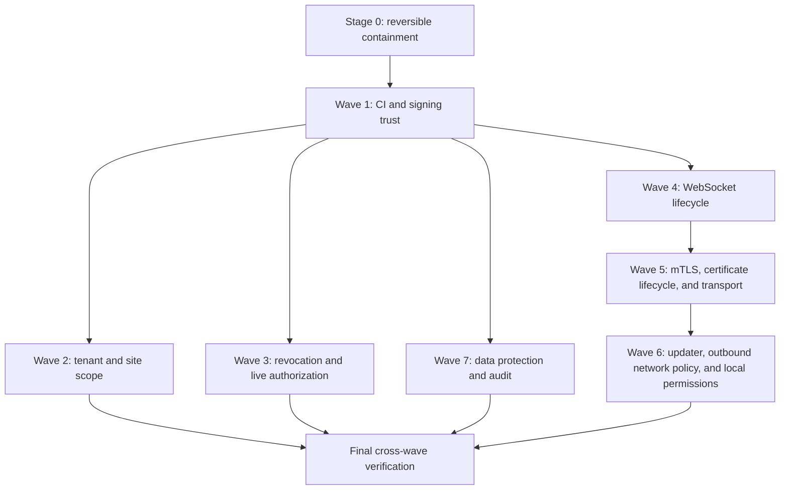

# Full Security Review Remediation Design

- **Date:** 2026-07-23
- **Status:** Approved for implementation planning
- **Source:** `internal/security-reviews/2026-07-23-full-security-review.md`
- **Original review baseline:** `d137f5d2826226548e324236995409b08755d785`
- **Initial reviewed baseline:** `6ddee2cc53db9f0fad55f63295a8144305127fac`
- **Latest upstream delta revalidated:** `6bbd949abdbad61a32d10add0de86572564cf4b4` (`v0.100.0`)

## Objective

Remediate all 25 independently verified findings from the 2026-07-23 security review without
creating an uncontrolled hosted or self-hosted rollout. Deliver the work as seven independently
reviewable code waves plus an operational containment runbook. Each wave must have an explicit
compatibility window, test gate, canary boundary, enforcement gate, and fail-closed rollback.

The source report remains internal. Public issues, pull-request descriptions, release notes, and
commit messages must describe the hardened invariant without publishing a working exploit before
the fix is broadly deployed.

## Revalidation result

Three read-only domain reviews reconciled every finding against a fresh `origin/main` worktree.
All 25 findings remain open at the revalidated baseline:

| Domain | Open findings |
|---|---:|
| CI and supply-chain trust | 4 |
| Tenant and site isolation | 2 |
| Authorization and capability revocation | 3 |
| WebSocket authentication and lifecycle | 2 |
| Agent identity, certificate lifecycle, and transport | 4 |
| Agent updater, outbound network policy, and local permissions | 5 |
| Data minimization, telemetry, and auditability | 5 |
| **Total** | **25** |

No intervening commit changed the vulnerable paths. The remediation program therefore covers the
full report rather than treating any entry as fixed, stale, or superseded.

## Scope decision

The remediation will use a risk-and-dependency program:

1. Run immediate reversible containment without waiting for every code wave.
2. Repair CI and signing trust before relying on CI to publish runtime security fixes.
3. Deliver seven code waves, one security boundary per branch and pull request.
4. Permit independent waves to proceed in parallel only when their file ownership, migration, and
   deployment boundaries do not overlap.
5. Deploy enforcement only after compatibility telemetry proves the relevant hosted and
   self-hosted path is ready.

A monolithic remediation branch is rejected because it would combine authentication, tenant
isolation, WebSockets, agent trust, database migrations, production edge policy, and CI signing in
one rollback boundary. A reduced program covering only the immediately exploitable findings is
also rejected because audit, revocation, and hardening gaps are explicit Breeze security
requirements and would otherwise reappear in later reviews.

## Security and rollout invariants

These requirements apply to every wave:

1. **CI trust comes first.** Pull-request-controlled code receives no repository secret. Signing
   requires independently approved protected execution. External actions are immutable.
2. **Unauthorized access fails closed.** A rollback must never silently restore cross-site data,
   stale authorization, secret-bearing exports, or unauthenticated remote input.
3. **Self-hosted mTLS remains opt-in.** Certificate/device enforcement defaults to off for
   self-hosted deployments and progresses through `off`, `audit`, and `enforce`.
4. **Private deployments remain supported.** The agent may reach its explicitly configured private
   control plane. Managed software may use explicitly approved LAN sources. The remediation must
   not impose a blanket RFC1918 ban.
5. **Mixed versions are a first-class state.** New servers accept the preceding agent/API behavior
   during a documented compatibility window. New agents tolerate the preceding server behavior
   until adoption gates are met.
6. **Migrations expand before code enforces.** New fields are additive and nullable or safely
   defaulted during mixed-version deployment. Backfills never invent authorization provenance.
7. **Tenant data remains protected by forced RLS.** Every new tenant table gets ENABLE/FORCE RLS,
   the correct tenancy policy, coverage allowlist entries, and a real cross-tenant forge test.
8. **Audit failure does not break authorized product use.** Sensitive-read and time-entry audit
   writes use the existing bounded, fail-open delivery path while surfacing retry/health signals.
9. **Observability contains no credentials.** Compatibility and enforcement telemetry uses bounded
   identifiers and reason codes, never raw tokens, URLs containing capabilities, credentials,
   private keys, report contents, or downloaded file content.
10. **Agent changes canary before promotion.** Every agent wave progresses through controlled
    release rings with explicit stop criteria and `go test -race` evidence.
11. **No shipped migration is edited.** All corrections use forward-only, date-prefixed,
    idempotent migrations with cleanup row-count reporting where applicable.
12. **One independent review per wave.** A fresh reviewer checks requirement compliance,
    security regression, migration safety, concurrency, and rollback before merge.

## Program structure



Waves 2, 3, 4, and 7 may be developed in parallel after Wave 1 when their branch ownership remains
separate. Waves 5 and 6 both affect fleet trust and should be released sequentially even when their
code is developed in parallel.

## Stage 0 — Reversible containment

Containment reduces exposure while code is prepared. It must be documented as an operator runbook,
not hidden inside an implementation PR.

### CI and credentials

- Remove Anthropic-assisted execution from pull-request-controlled code before rotating the
  affected key.
- Review recent same-repository pull-request workflow runs for unexpected behavior.
- Bind developer signing and notarization credentials to an independently reviewed protected
  environment before another arbitrary-branch signing run.
- Preserve arbitrary-branch unsigned builds; only signing requires approval.

### Hosted edge and origin

- Put the command-WebSocket mTLS expression into Cloudflare Log mode.
- Confirm current agents present their certificate on the command socket before blocking.
- Restrict direct API-origin reachability to the configured trusted proxy or tunnel.
- Inventory Cloudflare certificates no longer represented by the device's current certificate
  record and revoke them through an operator-reviewed process.

### Product exposure

- Temporarily prevent site-restricted users from creating or executing scheduled reports until
  report scope provenance is persisted.
- Hide historical unscoped report runs from site-restricted users without deleting them.
- Restrict tenant export to the smallest operational administrator set and review recent export
  audit events.
- Restrict managed-software execution permission and review configured download sources.
- Review telemetry retention and access for capability-bearing paths. Purge or restrict retained
  records before rotating still-live customer-facing capabilities.
- On Unix deployments, check current agent log directories and files for symlinks and repair modes
  to `0700` and `0600`.

Containment changes that could disconnect agents or invalidate customer links require an explicit
operator confirmation and a recorded rollback command.

## Wave 1 — CI and signing trust

**Findings:** `CI-ACTIONS-001`, `CI-PR-SECRET-001`, `CI-DEVSIGN-001`,
`CI-E2E-LOCK-001`.

### Pull-request trust boundary

The `pull_request` workflow remains deterministic and secret-free. It may run repository-controlled
tests, schema checks, static assertions, and browser tests, but receives no Anthropic or signing
credential. A secret-bearing later step on the same runner is also forbidden because earlier
untrusted code can persist a process or modify files consumed by that step.

Anthropic-assisted documentation verification moves to either:

- protected code after merge to the default branch on a fresh runner; or
- a manually approved protected environment that checks out a trusted immutable commit.

The design explicitly forbids `pull_request_target` combined with checkout or execution of the pull
request head.

### Deterministic dependencies

`e2e-tests` keeps its existing npm lockfile as the canonical standalone dependency contract. CI uses
`npm ci --prefix e2e-tests`; browser and script invocations use already installed packages and never
download an unpinned executable through an `npx` fallback.

### Developer signing

Build and signing become separate jobs:

1. Resolve the requested branch to an immutable commit SHA.
2. Build an unsigned artifact from exactly that SHA.
3. Record the source SHA and artifact digest.
4. Enter a reviewer-protected signing environment.
5. Download the unsigned artifact and verify its digest.
6. Sign and notarize without rebuilding source.

The protected workflow definition runs from the default branch. Ancestry to main is advisory for
developer builds; independent signing approval is mandatory.

### Action immutability

Pin every external `uses:` reference to a full commit SHA in one repository-wide mechanical change.
Preserve human-readable version comments for dependency automation. Flip the Zizmor policy from
major-tag exceptions to full hash enforcement in the same change; partial enforcement is not
mergeable.

### Wave 1 gate

- `actionlint` passes.
- Zizmor passes with no mutable-reference exception.
- A repository policy test rejects every external `uses:` value not containing a 40-character SHA.
- A trust-boundary test rejects `secrets.*` in pull-request workflows that execute checked-out code.
- `npm ci --prefix e2e-tests` succeeds without changing the lockfile.
- Protected signing reviewers and environment binding are verified through GitHub configuration,
  not inferred from YAML alone.

## Wave 2 — Tenant and site scope

**Findings:** `TENANT-SITE-REPORT-001`, `TENANT-SITE-AGG-001`.

### Report execution scope

Use one canonical versioned scope type throughout report and metric authorization:

```typescript
type SiteScopeV1 =
  | { version: 1; kind: 'unrestricted'; orgId: string }
  | { version: 1; kind: 'restricted'; orgId: string; siteIds: string[] }
  | { version: 1; kind: 'legacy_unscoped'; orgId: string };
```

`undefined` application scope means unrestricted. An empty `siteIds` array means restricted to no
sites. They must never be normalized into the same value.

Persist authorization provenance on both the report definition and each generated run:

- scope version and kind;
- normalized allowed site IDs;
- initiating user ID;
- a stable scope fingerprint used for baseline selection; and
- the authorization state needed to prove the creator remains eligible.

Scheduled execution uses the intersection of persisted scope and the creator's current permissions.
An inactive creator, removed membership, empty intersection, or unverifiable scope fails closed
before system context, query execution, snapshot storage, email delivery, or audit success.

List and download authorize the immutable run snapshot. A saved run is visible only when its scope
is a subset of the caller's current scope. Previous-baseline selection requires the same scope
fingerprint so an unrestricted historical baseline cannot contaminate a restricted report.

Historical rows are marked `legacy_unscoped`; they are never backfilled with invented site
provenance. Unrestricted administrators retain access. Legacy schedules require explicit
reauthorization before executing again. Database checks reject invalid kind/site-array combinations,
and new report types have no permissive default for restricted execution.

### Metrics

Device and remote-session aggregates receive a site predicate that is a no-op for unrestricted
callers. Site-restricted users see only accessible devices, sessions, and unassigned-device behavior
defined by the site-access contract.

Organization-only rollups cannot safely answer restricted trend queries. The first safe release
returns a documented denial for restricted `/trends` and hides the affected UI card. Site-dimensional
rollups or a bounded raw query are a later performance feature, not part of this remediation.

### Wave 2 gate

- Site A users receive no Site B rows, counts, summaries, baselines, attachments, or known-ID
  downloads.
- Scope narrowing and creator removal take effect before run and download.
- Empty site access returns zero-safe aggregates and no unassigned-device leakage.
- Unrestricted report and metric results remain unchanged.
- Migration reapplication is a no-op, schema drift is clean, and RLS coverage/forge tests pass.

## Wave 3 — Revocation and live authorization

**Findings:** `AUTH-OAUTH-001`, `P1-WS-003`, `PUBLIC-REVOKE-001`.

### OAuth user-state binding

OAuth access tokens carry the user's authorization epoch. Bearer authentication loads live
`users.status` and `users.auth_epoch` and rejects inactive or mismatched users independently of
Redis grant cleanup.

During one maximum access-token lifetime, a claimless legacy token is accepted only after the same
live user-state check. After that window, the epoch claim is required. Database inability to prove
live state fails closed with a retryable service response. A mandatory indexed user-row lookup is
the initial correctness design; any later cache has a bounded stale interval and database fallback.
Grant and JTI cleanup moves to a durable retry path as defense in depth, not as the primary
invalidation mechanism.

### Event permission epoch

Add a dedicated permission epoch that advances transactionally whenever partner membership,
organization membership, organization access, assigned role, or allowed-site IDs change. Prefer
database-triggered bumps for membership tables so alternate mutation paths cannot omit them.
Role-definition changes must fan out an epoch bump to every assigned user in the same durable
operation; scattered route-only bumps are not sufficient.

New event tickets snapshot the permission epoch. Open sockets compare live user status and epoch on
a jittered interval. Redis pub/sub may close sockets immediately, but the database epoch remains the
durable backstop. Transient database errors receive only a short bounded grace and then fail closed.

### Quote response capability

Separate quote viewing from the one-time legal response capability. Store the current response JTI,
consumption time, and outcome on the quote row. Accept or decline compares and consumes the JTI in
the same transaction as the terminal quote-state change.

Store an explicit public-token version so a legacy null JTI cannot be confused with a broken new
writer. Legacy version-zero rows with no stored JTI may atomically claim and consume the presented
response JTI. New sends write version one and the JTI in the same transition to sent. A rolled back
transaction leaves the capability unconsumed. Successful response consumption does not revoke
post-response quote viewing or assets unless a later product decision explicitly changes that
contract. Explicit read-link revocation remains a separate field and action.

### Wave 3 gate

- OAuth cleanup and Redis failures cannot preserve access for inactive or epoch-stale users.
- Claimless compatibility expires after the documented maximum token lifetime.
- Membership, role, and site changes close event sockets within the defined bound.
- Quote response is exactly once under concurrency and transaction rollback.
- Mixed-version API instances tolerate the new nullable fields until enforcement is enabled.

## Wave 4 — WebSocket authentication and lifecycle

**Findings:** `P1-WS-001`, `P1-WS-002`.

### Socket identity first

Before changing upgrade behavior, terminal, desktop, and tunnel handlers require exact socket
identity and connection generation for every message, ping/pong, close, and error event. A foreign,
unauthenticated, or replaced socket cannot relay input through, mutate, or tear down an existing
session found by identifier. A second valid connection is rejected while an owner remains active
rather than replacing it implicitly.

### Authentication before upgrade

After socket binding is deployed, consume and validate the one-time ticket in Hono middleware
before `upgradeWebSocket`, following the agent-WebSocket pattern. Invalid, expired, mismatched, or
consumed tickets never receive HTTP `101`.

Validated user, session, organization, site, permission, MFA, ticket JTI, and a fresh connection ID
are carried into handler construction. The user wire protocol does not change.

### Idempotent desktop teardown

All desktop close paths call one lifecycle routine keyed by session, expected socket, and connection
generation. The routine:

1. marks the session closing;
2. deduplicates concurrent close, error, and revocation through one in-flight cleanup;
3. clears timers;
4. sends `desktop_stream_stop`;
5. unregisters callbacks;
6. finalizes database and audit state; and
7. removes the active-session entry last.

The viewer is detached immediately; cleanup retry may continue without leaving capture active.

### Wave 4 gate

- A foreign socket cannot send, pong, close, or error-teardown another session.
- Pipelined pre-authentication frames never reach an agent.
- Invalid tickets never upgrade.
- Concurrent close paths emit one stop, one final state transition, and one audit event.
- Terminal, desktop, tunnel, agent, viewer, and reverse-proxy interoperability remain green.

## Wave 5 — Agent identity, certificate lifecycle, and transport

**Findings:** `P1-MTLS-001`, `P1-MTLS-002`, `P1-MTLS-004`, `TRANSPORT-001`.

### Durable certificate history

Before enforcing certificate/device identity, add a direct-organization, forced-RLS certificate
history table containing:

- organization and device identity;
- provider certificate ID and serial or fingerprint;
- issue and expiry time;
- state, including active, pending revocation, and revoked;
- retry count, last sanitized error, and next attempt time.

For capable agents, renewal is two-phase: persist the new certificate as pending activation, let the
agent save it, confirm using the new identity, activate it, and only then queue the old certificate
for revocation. Unconfirmed pending certificates expire and are revoked while the old certificate
remains usable. Legacy agents keep the current response flow augmented with history and durable
revocation.

Inline revocation marks success or provider-not-found as revoked. Other failures remain queued for
an idempotent retry worker. Tenant cascade, erasure, export classification, and RLS coverage ship
with the table.

Once certificate binding is active, renewal itself cannot remain an unrestricted bearer-only
certificate mint. Devices with a valid stored certificate present the matching certificate to
renew. Expired-certificate recovery requires proof of possession of the old private key or an
administrator-authorized re-enrollment/recovery flow; it never degrades permanently to bearer-only.

### Edge identity and route coverage

Hosted edge policy explicitly covers both exact agent REST identity paths and the command-WebSocket
path. Enrollment and renewal exemptions are expressed as exact routes, not broad string
exceptions.

The edge strips any client-supplied certificate identity header and overwrites it with a value
derived from the verified certificate. The API has one shared certificate-binding check used by
both REST agent authentication and duplicated command-WebSocket authentication.

### Enforcement modes

Certificate binding progresses through:

1. `off`;
2. `audit`, where missing headers, legacy NULL identities, and mismatches produce secret-free
   metrics without denial; and
3. `enforce`, initially only for devices with a stored certificate identity.

Hosted enforcement requires edge telemetry covering a deliberate fleet renewal or an agreed
observation window. Self-hosted enforcement remains explicitly opt-in and requires a trusted proxy
integration capable of supplying an equivalent protected identity assertion.

### HTTPS proxy trust

Effective request scheme trusts forwarded headers only from configured trusted proxies. Insecure
requests redirect only to a configured canonical HTTPS origin. An unrecognized Host is rejected
rather than reflected into `Location`.

The existing production proxy-CIDR validation remains the configuration authority; this wave does
not introduce a second conflicting fatal startup check.

### Wave 5 gate

- Forced revoke failure retains the old certificate for retry while preserving the new certificate.
- Retry is idempotent and treats provider-not-found as completed revocation.
- Matching certificate/device identity succeeds; mismatch and trusted-header spoof attempts follow
  the active enforcement mode.
- Staging proves no-certificate command sockets are blocked only after correct-certificate sockets
  are healthy.
- Caddy, Cloudflare, and direct-origin positive and negative scheme/host cases pass.
- Self-hosted defaults remain behaviorally unchanged until an operator opts in.

## Wave 6 — Agent updater, outbound network policy, and local permissions

**Findings:** `P1-UPD-003`, `P1-UPD-001`, `P1-UPD-002`, `SSRF-AGENT-001`,
`P1-AGENT-LOG-001`.

### Version precedence

Use one standards-compliant SemVer decision function that retains prerelease precedence, permits an
optional `v` prefix, and rejects malformed server targets. A development main-agent build may keep
the documented compatibility behavior for an unparseable current version; helper and watchdog
targets fail closed.

Do not add a permanent highest-ever-version watermark in this wave because it would block
operator-directed recovery rollbacks and could strand self-hosted fleets.

### Shared outbound network policy

Updater and managed-software downloads share one transport policy:

- validate every redirect;
- re-resolve and reject universally unsafe loopback, link-local, unspecified, multicast, and
  metadata destinations at dial time;
- prevent HTTPS-to-HTTP downgrade when the control plane is HTTPS;
- remove authorization on origin changes;
- retain redirect limits, timeout, and response-size bounds;
- permit the explicitly configured private control plane; and
- permit approved private software sources through an explicit organization/site allowlist.

The policy does not pin public CDN IPs and does not rely only on `IS_HOSTED`. Agent-side dial
enforcement remains authoritative even when API validation rejects obvious unsafe literals.

Enterprise proxy behavior is explicit. Security-sensitive clients either bypass environment
proxies, use an explicitly configured trusted proxy, or combine destination pre-resolution with a
proxy that contractually enforces the same destination policy. A custom dialer must not accidentally
validate only the proxy address while leaving the ultimate request destination unchecked.

### Manifest-key identity and rotation

Represent trusted manifest keys by key ID and verify against the exact `signingKeyId` already
provided by the API. First deployment bootstrap remains available when no deployment key is pinned;
an identical existing key is idempotent; an unseen second key is rejected.

Ship exact-ID compatibility before requiring the ID from every server. A later delegated rotation
record contains old and new key IDs, new public key, monotonic epoch, and validity window, signed by
the currently trusted old key. Rotation remains frozen until this protocol is deployed and adopted.

### Unix log safety

Unix logging rejects directory and current-log symlinks, opens with no-follow and close-on-exec
semantics, repairs the opened descriptor to `0600`, repairs the directory to `0700`, and applies the
same policy during reopen and rotation. Backup logs receive the same mode repair.

Unsupported filesystem permission repair emits a prominent bounded warning but does not crash the
agent solely because chmod or chown is unavailable. A symlinked log stops receiving file output
without modifying the symlink target; system/stderr logging remains available. Windows behavior
remains unchanged.

### Wave 6 rollout

1. Ship SemVer, log repair, and the shared outbound-network guard as an agent-only,
   backward-compatible release.
2. Canary through controlled rings with stop criteria for update, managed-software, and private
   control-plane failures.
3. Ship exact manifest key-ID preference with temporary missing-ID compatibility.
4. Require key IDs only after server and fleet coverage.
5. Design and deploy signed delegation before unfreezing key rotation.

Normal automatic-update downgrade remains prohibited. If a canary must be rolled back, stop
promotion and ship a higher-version forward fix or use the explicit operator recovery path; the
runbook must not assume that publishing the previous version will downgrade upgraded agents.

### Wave 6 gate

- `go test -race` passes for heartbeat, updater, configuration, logging, remote tools, and the full
  agent.
- Stable-to-prerelease downgrade, malformed target, redirect-to-unsafe-address, DNS rebinding,
  authorization stripping, private control-plane, approved LAN source, key-ID mismatch, and symlink
  cases have regression tests.
- Canary telemetry shows no unexpected private-control-plane or managed-software denial.
- Agent rollback preserves the preceding compatible server path.

## Wave 7 — Data protection, telemetry, and auditability

**Findings:** `SEC-LOG-001`, `DP-EXPORT-001`, `AUDIT-001`, `AUDIT-READ-001`,
`DP-PUBLIC-QUOTE-001`.

### Safe telemetry paths

Introduce one request-label helper based on the matched Hono route template. Before route
resolution, telemetry records a correlation ID without a pathname. After resolution, logs and
Sentry contain only the route template and bounded metadata.

Sentry scrubbing removes raw request URL, path, query, transaction, tag, context, and breadcrumb
fields and never falls back to the untrusted raw path. Unmatched routes receive a fixed label such
as `unmatched`. Tests seed quote, invite, provisioning, installer, and remote-access path
capabilities and prove that token bytes cannot appear in logs or serialized Sentry events.

### Tenant export classification

Preserve automatic cascade-table discovery so newly tenant-scoped tables are not silently omitted.
Apply a deny-by-default column classification before querying, so secret fields never enter process
memory or the archive.

The initial prohibited classes include password verifiers, MFA seeds and recovery codes, API and
token hashes, plaintext or encrypted access/refresh tokens, client secrets, private keys,
credential JSON, webhook secrets, backup encryption keys, and live provisioning handles.
Open-ended containers such as credentials, headers, config, settings, metadata, and opaque
JSON/blob columns require explicit classification even when their column names are neutral.

An information-schema contract fails when a cascade table adds a suspicious or unclassified column.
Extension tables fail the export safely on suspicious unclassified fields. Export filenames and
manifest structure remain stable; no supported import/restore consumer depends on the removed
secret columns.

### Explicit audit ownership

Time-entry lifecycle mutations emit audit records using the organization resolved from the affected
entry, not generic request fallback. Bulk operations emit per affected organization. Genuinely
partner-level entries use the documented nullable organization representation. The generic fallback
excludes time-entry paths in the same change to prevent duplicate records.

Sensitive file, contract, billing, and report downloads emit audit only after successful retrieval.
Metadata contains actor, organization, resource identity, format, row count, and byte count—never
content or credentials. Audit delivery uses the existing non-blocking retry path.

### Public quote DTO

Replace database-row spreading with an explicit customer response contract. Preserve seller
snapshot, billing name, status, dates, currency, terms, deposits, category breakdown, and recurring
totals required by the portal. Exclude internal tenant, creator, invoice, document, delivery-job,
failure-reason, and internal timestamp fields.

### Wave 7 gate

- Exact-keyset tests prove no internal quote field is serialized.
- Export fixtures populate every classified secret and prove neither key nor value appears in the
  archive.
- Information-schema classification fails on a new suspicious field.
- Successful and failed sensitive reads produce exactly the intended audit behavior.
- Audit records contain no downloaded content or capability.
- Telemetry retains route-level diagnostics without raw path values.
- Portal typecheck and quote rendering remain green.

## Data changes and mixed-version contract

| Change | Tenancy | Expansion behavior | Enforcement point |
|---|---|---|---|
| Report definition/run execution scope | Existing report tenancy | Historical values become `legacy_unscoped`; no invented site scope | Worker, list, download, baseline selection |
| User permission epoch | User-scoped | Existing users start at a stable default; old tickets omit the claim during compatibility | Event ticket mint and periodic socket check |
| Quote response version/JTI/consumption/link revocation | Existing quote row | Nullable fields preserve old links; version-zero response claims atomically | Accept/decline transaction and explicit read-link revocation |
| OAuth revocation retry state | User-scoped durable work | Live bearer check is authoritative even before retries drain | Bearer middleware and cleanup worker |
| Device mTLS certificate history | Direct `org_id`, forced RLS | Existing current certificate may be imported as active when provenance is reliable | Renewal route, retry worker, binding check |

Every migration receives a mixed-version test proving old readers tolerate the expansion and new
readers fail safely when provenance is absent.

## Verification strategy

### Per-task TDD

Each implementation task follows:

1. add a focused failing regression;
2. run it and record the expected vulnerable failure;
3. implement the minimum invariant;
4. rerun the focused test;
5. run the containing package suite;
6. obtain an independent review; and
7. commit only the task's files.

### Authorization and database gates

- Unauthenticated, wrong scope, wrong permission, wrong organization, denied site, empty site
  allowlist, stale epoch, inactive actor, and known-ID access cases.
- Denied requests produce no write, queue submission, external call, system-context transition,
  snapshot, email, or success audit.
- RLS coverage and real `breeze_app` cross-tenant forges for every new tenant shape.
- Migration idempotency, schema drift, and mixed-version application tests.

### Redis and failure-injection gates

- Redis unavailable before and after database commit.
- Retry worker duplicate delivery.
- Database unavailable during live authorization.
- Provider certificate revoke timeout, failure, and not-found.
- Audit delivery failure without loss of authorized product behavior.

### WebSocket and concurrency gates

- Raw pipelined frame before authentication completion.
- Foreign or stale-generation socket using a known session identifier.
- Concurrent close, error, revocation, and timeout.
- Membership/site change while an event socket remains open.
- Reverse-proxy upgrade behavior across hosted and self-hosted configurations.

### Agent gates

- Targeted and full `go test -race`.
- Public redirect success and unsafe redirect failure.
- DNS rebinding and dial-time destination checks.
- Private control-plane and approved LAN-source compatibility.
- Agent/server version skew and canary stop conditions.

### CI and packaging gates

- Actionlint, Zizmor, secret-boundary policy, immutable-action policy, and standalone frozen install.
- API typecheck and affected Vitest files.
- Portal typecheck/render tests.
- Docker build paths affected by dependency or workflow changes.
- Required GitHub environment reviewer configuration verified outside repository YAML.

## Delivery, monitoring, and rollback

Each wave uses a fresh branch/worktree from the then-current `origin/main`. A wave may not merge
while its base is stale relative to a security-sensitive overlapping change.

Deployment follows:

1. migration or compatibility expansion;
2. tolerant application code;
3. audit/observe mode;
4. canary population;
5. explicit evidence review;
6. partial enforcement;
7. broad enforcement; and
8. post-deploy verification.

Rollback removes or disables enforcement while retaining forward-compatible schema and durable
security state. Rollback does not:

- re-enable unscoped scheduled reports;
- accept stale OAuth or event authorization;
- restore secret-bearing exports;
- accept foreign WebSocket ownership;
- discard pending certificate revocation;
- trust unseen manifest keys; or
- return raw capability paths to telemetry.

Release notes describe administrator-visible behavior changes without exploit mechanics. Hosted and
self-hosted runbooks list required configuration, observation evidence, activation, and rollback
steps separately.

## Completion criteria

The remediation program is complete only when:

1. Every one of the 25 finding IDs maps to a merged regression test or enforceable repository/deploy
   policy.
2. Every new tenant table passes forced-RLS coverage and a real cross-tenant forge.
3. Hosted and self-hosted compatibility matrices pass for the affected paths.
4. Agent waves pass controlled rings and full race-enabled tests.
5. No pull-request-controlled code receives a repository secret.
6. No protected signing operation can run without independent approval and artifact digest
   verification.
7. No capability-bearing raw path reaches logs or Sentry.
8. Historical secret/export and telemetry exposure has an operator-reviewed response record.
9. Every wave has an independent final review with no unresolved Critical or Important finding.
10. The internal tracker records containment, code, rollout, and enforcement status separately.

## Non-goals

- Re-running discovery for already verified findings.
- Publishing exploit reproduction steps before broad remediation.
- Forcing mTLS on self-hosted deployments.
- Blocking every private-network software source.
- Replacing existing WebSocket wire protocols.
- Adding a permanent highest-ever agent-version watermark.
- Revoking post-response quote viewing without a separate product decision.
- Refactoring unrelated routes or splitting files only for line-count targets.
